  

  

---

## 🚀 About Me  

- 🎓 CSE Student  
- 🔐 Interested in **Cybersecurity & Ethical Hacking**  
- 💡 Building **AI + Security based projects**  
- 📈 Practicing **DSA in Java**  
- 🤝 Batch Representative  

---

## 🎮 Contribution Radar

  

---

## 🛠️ Tech Stack  

### 👨‍💻 Languages  

  
  
  
  
  

### 🗄️ Database  

  
  
  

### ⚙️ Tools & Platforms  

  
  
  
  

---

## 🔥 Featured Projects  

| Project | Description | Tech |
|--------|------------|------|
| 🧠 **AI Interview Coach** | AI system analyzing voice, facial expressions & responses | Python |
| 🌐 **IP Port Scanner** | Performs IP discovery, port scanning & risk analysis | Bash, Nmap |
| 👁️ **Intent Watch** | AI surveillance system detecting suspicious activities | TypeScript |

---

## 📊 GitHub Stats  

  
  

---

## 🌐 Connect With Me  

  
  
  

---

## ⚡ Fun Fact  
I build projects not just for academics, but to solve **real-world problems** 🚀  
